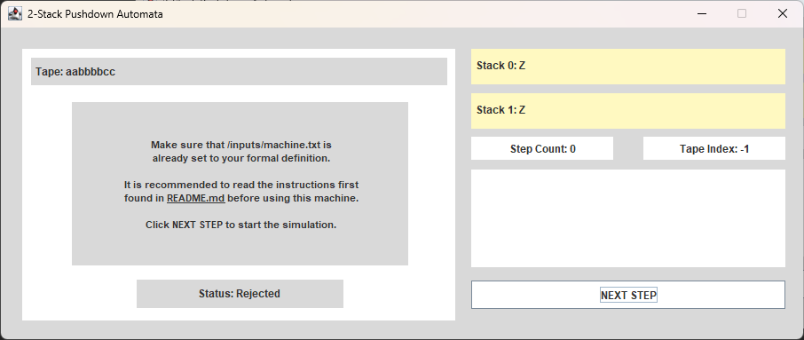

# STALGCM Case Study
A simple software system to implement the machine definition and testing of a Two-Stack Pushdown Automata.

Made by [Josh Austin Mikhail T. Natividad](https://github.com/austinatividad) and [Christian Dave P. Tordillo](https://github.com/Christian-Tordillo).

**This README.md file contains:**
- [Formal Definition Instructions](#formal-definition-instructions)
- [UI Design and Navigation](#ui-design-and-navigation)
- [Sample Input and Output](#sample-input-and-output)
- [Running the Program](#running-the-program)

# Machine: Two-Stack PDA
## Formal Definition Instructions
To create a Machine Definition, the user must modify [machine.txt](./inputs/machine.txt) in the following format:
```bash
3              #number of states
A B C          #state names
5              # size of input tape
0 1 0 1 0      # input tape; input alphabet is derived from this
4              # number of stack symbols
a b c d        # symbol names
3              # number of transitions
A 1 L L L L B  # Transition functions, L will be a const for lambda
B 0 L a b L C  # Format:
B 1 a L L L B  # Current state, pop stack1, push stack1, pop stack2, push stack2, next state
A              # start state
2              # number of final states
B C            # final states 
```
Without the comments, the file should look like this:

###### Sample PDA that accepts the language {0^n 1^n 2^n | n >= 0}

```bash
4
A B C D
9
0 0 0 1 1 1 2 2 2
1
0
6
B L L L L L C
A 0 L 0 L 0 A
C 2 L L 0 L C
C L Z L Z L D
B 1 0 L L L B
A L L L L L B
A
1
D
```


It is assumed that [machine.txt](./inputs/machine.txt) is always in the correct format. The program will not execute if the format is incorrect.

### Formal Definition Restrictions
- "L" is a reserved keyword for lambda. It cannot be used as a state or stack symbol name, doing so will cause the program to malfunction.
- Number of states must be greater than 0.
- Number of transitions must be greater than 0.
- Initial and Final states must be defined, and in the list of states.
- Input tape must be defined, and the input alphabet is derived from the input tape.
- Number of stack symbols must be greater than 0.
- The transition functions must strictly follow the format.
- Multiple symbol pop and push is supported.

## UI Design and Navigation
### Components

- [machine.txt](./inputs/machine.txt) - The file that contains the machine definition.
- [Main](./src/Main.java) - The main file that runs the program.
- [Machine](./src/Machine/Machine.java) - The class that contains the machine definition and the methods to run the machine.
- [View](./src/View) - Folder that contains the UI files.
- [Inputs](./src/Inputs) - Folder that contains all the classes for defining the machine.

### UI Design

- **Main Window**
  - Input Tape - The input tape of the machine.
  - Current state - The current state of the machine.
  - Acceptance status - The acceptance status of the machine.
  - Stack 0 - The stack 0 of the machine.
  - Stack 1 - The stack 1 of the machine.
  - Step counter - The number of steps the machine has taken.
  - Tape index - The current index of the input tape.
  - Transitions used - The transitions used by the machine.
  - Step button - The button to run the machine one step at a time.




This is what the UI should look like after a successful run.


- **Transition List**
  - The list of transitions that are available to be used by the machine.

<div style="text-align: center;">


</div>

The transition functions reachable by the current state will be highlighted in blue, while the transition
last used by the machine will be highlighted in red.

<div style="text-align: center;">


</div>

## Sample Input and Output
**1st Case: using Stack 0**

A machine that accepts the language {a^n b^n, n>=1} <br>
Only using stack 0

```bash
4
A B C D
8                 #change to test other inputs
a a a a b b b b   #change to test other inputs
1
X
5
A a L X L L A
A L L L L L B
B L L L L L C
B b X L L L B
C L Z L Z L D
A
1
D
```

**2nd Case: using Stack 1**

A machine that accepts the language {a^n b^m, n,m>=1 ∧ m = 2n} <br>
Only using stack 1

```bash
4
A B C D
12                       #change to test other inputs
a a a a b b b b b b b b  #change to test other inputs
1                        
X
5
A a L L L XX A
A L L L L L B
B L L L L L C
B b L L X L B
C L Z L Z L D
A
1
D
```


**3rd case: A machine that uses both stacks**


A machine that accepts the language {a^n b^m, n>=1 ∧ m>=1 ∧ m = 2n} <br>
Using Stack 0 and Stack 1, fully utilizing the machine.

```bash
4
A B C D
6                   #change to test other inputs
a a b b b b c c     #change to test other inputs
1
X
6
A a L XX L X A
A L L L L L B
B b X L L L B
B L L L L L C
C c L L X L C
C L Z L Z L D
A
1
D
```

## Running the Program
To run the program, simply run [Main.java](./src/Main.java) in your IDE of choice. <br>
